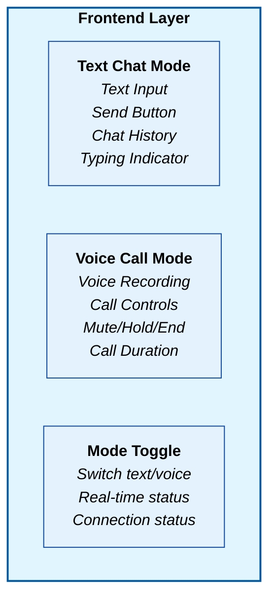
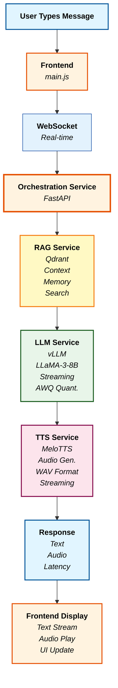
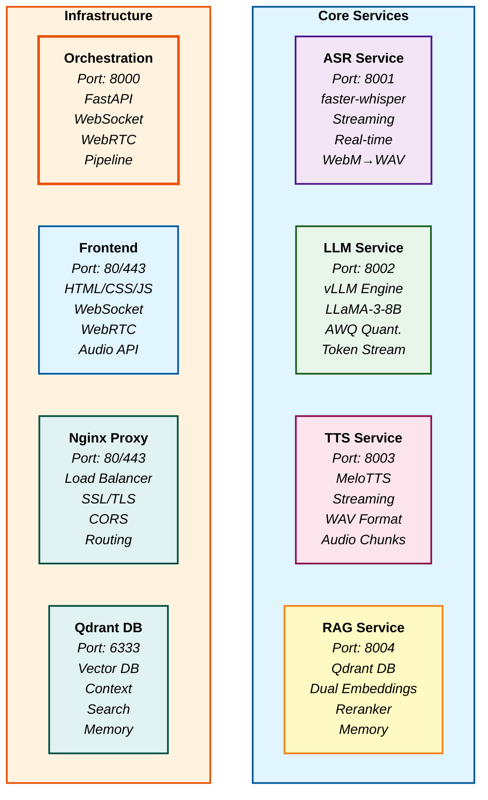
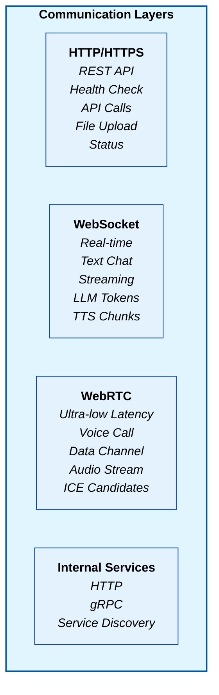
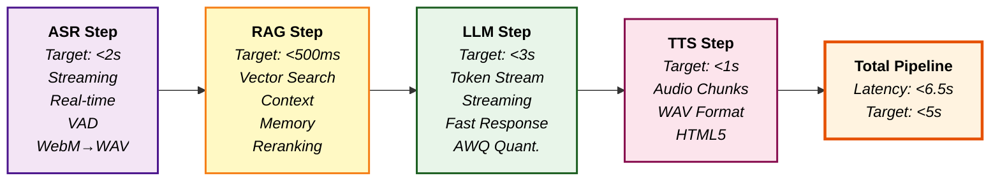

# Zevo AI - End-to-End Voice & Text Processing Architecture

## System Architecture Overview

**Zevo AI Conversational Platform** - Production-Grade Multilingual Voice Agent

## Frontend Layer (User Interface)

### Dual-Mode Interface



## Processing Pipeline Architecture

### 1. TEXT MODE FLOW



### 2. VOICE MODE FLOW

```mermaid
graph TB
    UserSpeaks["<b>User Speaks</b><br/><i>Voice Call Mode</i>"]

    Frontend1["<b>Frontend</b><br/><i>main.js</i><br/><i>VAD</i><br/><i>Recording</i><br/><i>Auto-stop</i>"]
    WebRTC["<b>WebRTC</b><br/><i>Data Channel</i><br/><i>Ultra-low Latency</i>"]
    Orchestration["<b>Orchestration Service</b><br/><i>FastAPI</i>"]

    ASR["<b>ASR Service</b><br/><i>faster-whisper</i><br/><i>Streaming</i><br/><i>Real-time</i><br/><i>WebM→WAV</i>"]

    RAG["<b>RAG Service</b><br/><i>Qdrant</i><br/><i>Context</i><br/><i>Memory</i><br/><i>Search</i>"]

    LLM["<b>LLM Service</b><br/><i>vLLM</i><br/><i>Streaming</i><br/><i>Tokens</i><br/><i>Real-time</i>"]

    TTS["<b>TTS Service</b><br/><i>MeloTTS</i><br/><i>Audio Gen.</i><br/><i>WAV Format</i><br/><i>Streaming Chunks</i>"]

    WebRTCResponse["<b>WebRTC Response</b><br/><i>Audio</i><br/><i>Text</i><br/><i>Streaming</i>"]

    Frontend2["<b>Frontend Playback</b><br/><i>HTML5 Audio</i><br/><i>Real-time</i><br/><i>Continuous</i>"]

    AutoListen["<b>Auto-Listen</b><br/><i>VAD</i><br/><i>Continuous</i><br/><i>Two-way</i>"]

    UserSpeaks --> Frontend1
    Frontend1 --> WebRTC
    WebRTC --> Orchestration
    Orchestration --> ASR
    ASR --> RAG
    RAG --> LLM
    LLM --> TTS
    TTS --> WebRTCResponse
    WebRTCResponse --> Frontend2
    Frontend2 --> AutoListen
    AutoListen --> UserSpeaks

    style UserSpeaks fill:#e1f5ff,stroke:#01579b,stroke-width:2px,color:#000
    style Frontend1 fill:#fff3e0,stroke:#e65100,stroke-width:2px,color:#000
    style Frontend2 fill:#fff3e0,stroke:#e65100,stroke-width:2px,color:#000
    style WebRTC fill:#e3f2fd,stroke:#0d47a1,stroke-width:2px,color:#000
    style Orchestration fill:#fff3e0,stroke:#e65100,stroke-width:3px,color:#000
    style ASR fill:#f3e5f5,stroke:#4a148c,stroke-width:2px,color:#000
    style RAG fill:#fff9c4,stroke:#f57f17,stroke-width:2px,color:#000
    style LLM fill:#e8f5e9,stroke:#1b5e20,stroke-width:2px,color:#000
    style TTS fill:#fce4ec,stroke:#880e4f,stroke-width:2px,color:#000
    style WebRTCResponse fill:#e3f2fd,stroke:#0d47a1,stroke-width:2px,color:#000
    style AutoListen fill:#e1f5ff,stroke:#01579b,stroke-width:2px,color:#000
```



## Service Layer Architecture

### Core Services



## Network & Communication Flow

### Protocol Stack



## Data Flow & Latency Optimization

### Latency Tracking



## Continuous Conversation Flow

### Voice Call Mode (Phone-like)

```mermaid
graph LR
    Start["<b>Start Call</b>"]
    Listen["<b>Listen</b>"]
    UserSpeaks["<b>User Speaks</b>"]
    AutoProcess["<b>Auto-Process</b>"]
    AIResponds["<b>AI Responds</b>"]
    ListenAgain["<b>Listen Again</b>"]

    Start -->|WebRTC Connect| Listen
    Listen -->|VAD/3s Timer| UserSpeaks
    UserSpeaks -->|ASR→Text Streaming| AutoProcess
    AutoProcess -->|LLM→Tokens Streaming| AIResponds
    AIResponds -->|TTS→Audio Streaming| ListenAgain
    ListenAgain -->|Auto-Listen Continuous| UserSpeaks

    style Start fill:#e1f5ff,stroke:#01579b,stroke-width:2px,color:#000
    style Listen fill:#e3f2fd,stroke:#0d47a1,stroke-width:1px,color:#000
    style UserSpeaks fill:#fff3e0,stroke:#e65100,stroke-width:2px,color:#000
    style AutoProcess fill:#f3e5f5,stroke:#4a148c,stroke-width:2px,color:#000
    style AIResponds fill:#e8f5e9,stroke:#1b5e20,stroke-width:2px,color:#000
    style ListenAgain fill:#e3f2fd,stroke:#0d47a1,stroke-width:1px,color:#000
```



**Features:**

- Mute/Unmute
- Hold/Resume
- End Call
- Call Duration
- Two-way Talk
- Auto-Listen
- VAD
- Real-time Status

## Technology Stack

### Frontend Technologies

- **HTML5/CSS3**: Modern UI with Tailwind CSS
- **JavaScript**: ES6+ with WebSocket & WebRTC APIs
- **Web Audio API**: Advanced audio processing
- **WebRTC**: Ultra-low latency communication
- **VAD**: Voice Activity Detection

### Backend Technologies

- **FastAPI**: High-performance Python web framework
- **vLLM**: High-throughput LLM inference
- **MeloTTS**: High-quality text-to-speech
- **faster-whisper**: Optimized ASR
- **Qdrant**: Vector database for RAG
- **WebSocket**: Real-time communication
- **Docker**: Containerized services

### Infrastructure

- **Nginx**: Reverse proxy & load balancer
- **Docker Compose**: Service orchestration
- **SSL/TLS**: Secure communication
- **WebRTC**: P2P communication
- **STUN/TURN**: NAT traversal

## Key Features

### Text Mode

- Real-time text chat
- Streaming LLM responses
- Audio playback
- Conversation history
- Latency monitoring

### Voice Mode

- Continuous voice calls
- Phone-like conversation
- Mute/Hold/End controls
- Auto-listening
- Two-way communication
- Call duration tracking

### Performance

- <6.5s total latency
- Real-time streaming
- Ultra-low latency WebRTC
- Optimized audio processing
- Memory management
- Error recovery

## Configuration

### Environment Variables

```bash
# Service Ports
ASR_SERVICE_URL=http://asr-service:8001
LLM_SERVICE_URL=http://llm-service:8002
TTS_SERVICE_URL=http://tts-service:8003
RAG_SERVICE_URL=http://rag-service:8004

# WebRTC Configuration
WEBRTC_ENABLED=true
ICE_SERVERS=[{"urls": "stun:stun.l.google.com:19302"}]

# Audio Configuration
SAMPLE_RATE=16000
CHUNK_DURATION_MS=30
USE_OPUS=false
BITRATE=16
```

This architecture provides a complete, production-ready conversational AI platform with both text and voice capabilities, optimized for real-time performance and user experience.
