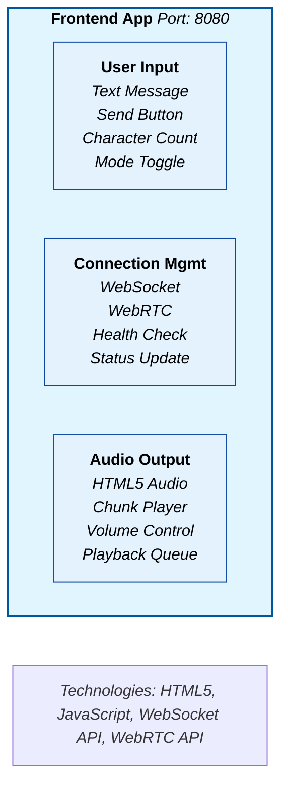
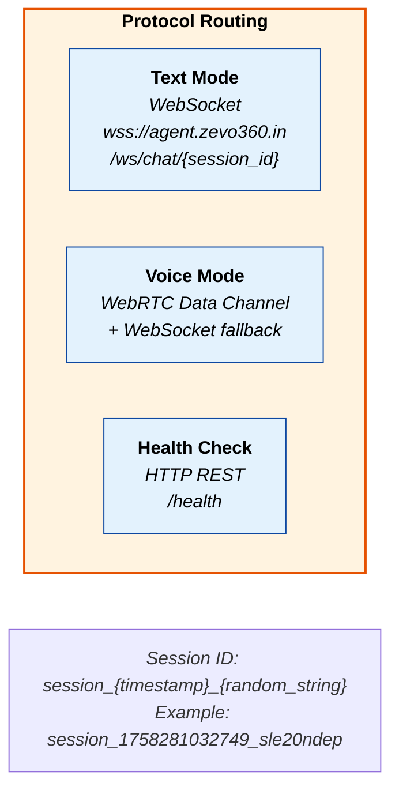
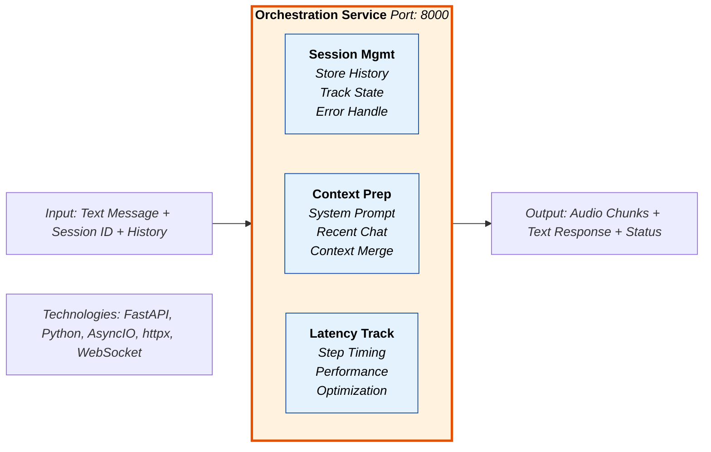
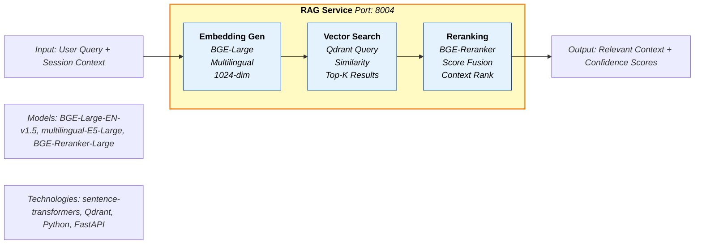
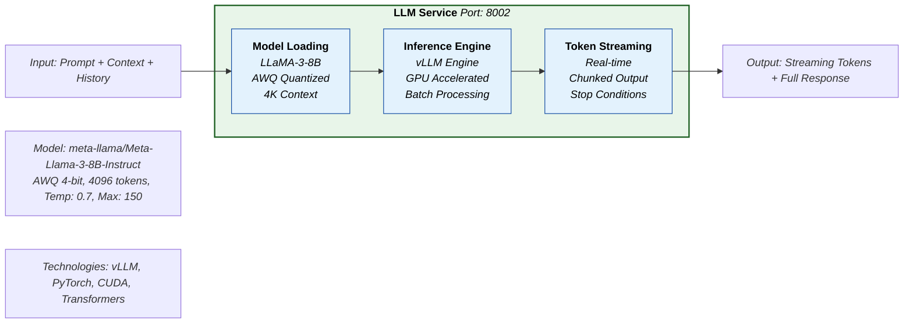
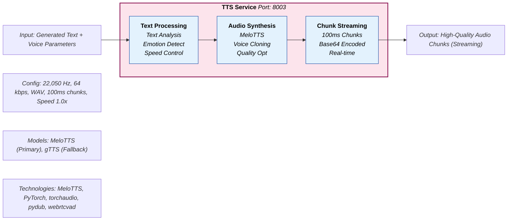
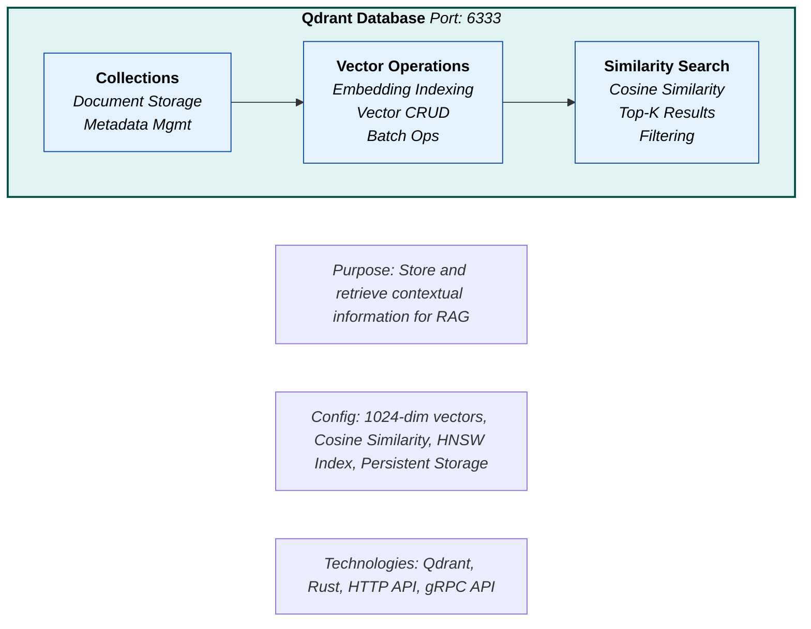

# Zevo AI - End-to-End Workflow Diagram

## Complete End-to-End Workflow for Text Mode

**Zevo AI - End-to-End Workflow**: Text Input → AI Processing → Audio Output

## Step 1: User Interface Layer



## Step 2: Communication Layer



## Step 3: Orchestration Service



## Step 4: RAG Service (Context Retrieval)



## Step 5: LLM Service (Text Generation)



## Step 6: TTS Service (Audio Synthesis)



## Step 7: Vector Database



## Complete End-to-End Data Flow

```mermaid
graph LR
    UserInput["<b>User Input</b><br/><i>Hi there!</i>"]

    Frontend1["<b>Frontend App</b><br/><i>Port: 8080</i><br/><i>Input validation</i><br/><i>UI updates</i><br/><i>WebSocket connection</i>"]

    Orchestration["<b>Orchestration</b><br/><i>Port: 8000</i><br/><i>Session management</i><br/><i>History storage</i><br/><i>Context prep</i><br/><i>Pipeline coordination</i>"]

    RAG["<b>RAG Service</b><br/><i>Port: 8004</i><br/><i>BGE-Large-EN-v1.5</i><br/><i>Qdrant vector search</i><br/><i>BGE-Reranker</i><br/><i>Context retrieval</i>"]

    LLM["<b>LLM Service</b><br/><i>Port: 8002</i><br/><i>LLaMA-3-8B-Instruct</i><br/><i>AWQ quantized</i><br/><i>vLLM inference</i><br/><i>Token streaming</i>"]

    TTS["<b>TTS Service</b><br/><i>Port: 8003</i><br/><i>MeloTTS</i><br/><i>22,050 Hz, 64 kbps</i><br/><i>WAV format</i><br/><i>100ms chunks</i>"]

    Frontend2["<b>Frontend App</b><br/><i>Port: 8080</i><br/><i>HTML5 audio playback</i><br/><i>Real-time processing</i><br/><i>UI updates</i><br/><i>History update</i>"]

    AudioOutput["<b>Audio Output</b><br/><i>Hi there! It's nice</i><br/><i>to chat with you...</i>"]

    UserInput -->|WebSocket| Frontend1
    Frontend1 -->|WebSocket Message| Orchestration
    Orchestration -->|HTTP Request| RAG
    RAG -->|HTTP Request| LLM
    LLM -->|HTTP Request| TTS
    TTS -->|WebSocket Stream| Frontend2
    Frontend2 --> AudioOutput

    style UserInput fill:#e1f5ff,stroke:#01579b,stroke-width:2px,color:#000
    style Frontend1 fill:#fff3e0,stroke:#e65100,stroke-width:2px,color:#000
    style Frontend2 fill:#fff3e0,stroke:#e65100,stroke-width:2px,color:#000
    style Orchestration fill:#fff3e0,stroke:#e65100,stroke-width:3px,color:#000
    style RAG fill:#fff9c4,stroke:#f57f17,stroke-width:2px,color:#000
    style LLM fill:#e8f5e9,stroke:#1b5e20,stroke-width:2px,color:#000
    style TTS fill:#fce4ec,stroke:#880e4f,stroke-width:2px,color:#000
    style AudioOutput fill:#e1f5ff,stroke:#01579b,stroke-width:2px,color:#000
```



## Performance Metrics & Timing

```
┌─────────────────────────────────────────────────────────────────────────────────┐
│                        PERFORMANCE METRICS & TIMING                           │
├─────────────────────────────────────────────────────────────────────────────────┤
│                                                                                 │
│  RESPONSE TIMING BREAKDOWN:                                                  │
│  • Connection initialization: ~360ms                                            │
│  • Session management: ~50ms                                                   │
│  • Context preparation: ~100ms                                                  │
│  • RAG retrieval: ~200ms                                                       │
│  • LLM generation: ~2,000ms (streaming)                                        │
│  • TTS synthesis: ~1,500ms (streaming)                                        │
│  • Audio playback: ~4,000ms (100+ chunks)                                     │
│  • Total end-to-end: ~4,600ms                                                  │
│                                                                                 │
│  THROUGHPUT CAPABILITIES:                                                   │
│  • LLM: 50+ tokens/second (vLLM optimized)                                     │
│  • TTS: 100+ chunks/second (MeloTTS streaming)                                │
│  • RAG: 1000+ queries/second (Qdrant vector search)                          │
│  • WebSocket: 1000+ messages/second (real-time)                              │
│                                                                                 │
│  RESOURCE UTILIZATION:                                                      │
│  • GPU Memory: ~8GB (LLM + TTS)                                               │
│  • CPU Usage: ~40% (orchestration + RAG)                                      │
│  • RAM Usage: ~16GB (all services)                                            │
│  • Network: ~1MB/s (audio streaming)                                          │
└─────────────────────────────────────────────────────────────────────────────────┘
```

## Technology Stack Summary

```
┌─────────────────────────────────────────────────────────────────────────────────┐
│                            TECHNOLOGY STACK SUMMARY                            │
├─────────────────────────────────────────────────────────────────────────────────┤
│                                                                                 │
│  FRONTEND:                                                                      │
│  • HTML5, JavaScript, WebSocket API, WebRTC API                               │
│  • Real-time UI updates, audio playback, connection management                │
│                                                                                 │
│  BACKEND SERVICES:                                                              │
│  • Python, FastAPI, AsyncIO, httpx                                            │
│  • Docker containerization, health monitoring                                 │
│                                                                                 │
│  AI MODELS:                                                                     │
│  • LLaMA-3-8B-Instruct (AWQ quantized) - LLM                                  │
│  • BGE-Large-EN-v1.5 - English embeddings                                     │
│  • multilingual-E5-Large - Multilingual embeddings                           │
│  • BGE-Reranker-Large - Context reranking                                     │
│  • MeloTTS - Neural text-to-speech                                             │
│                                                                                 │
│  INFRASTRUCTURE:                                                                │
│  • vLLM - High-throughput LLM inference                                       │
│  • Qdrant - Vector database                                                    │
│  • Docker Compose - Service orchestration                                     │
│  • GPU acceleration (CUDA)                                                     │
│                                                                                 │
│  COMMUNICATION:                                                                 │
│  • WebSocket - Real-time bidirectional communication                          │
│  • HTTP/REST - Service-to-service communication                               │
│  • WebRTC - Ultra-low latency voice communication                             │
└─────────────────────────────────────────────────────────────────────────────────┘
```

This end-to-end workflow diagram shows the complete journey from user text input to audio output, including all service names, models used, communication protocols, and performance metrics. The system is designed for production-grade conversational AI with real-time streaming and high-quality audio output.
