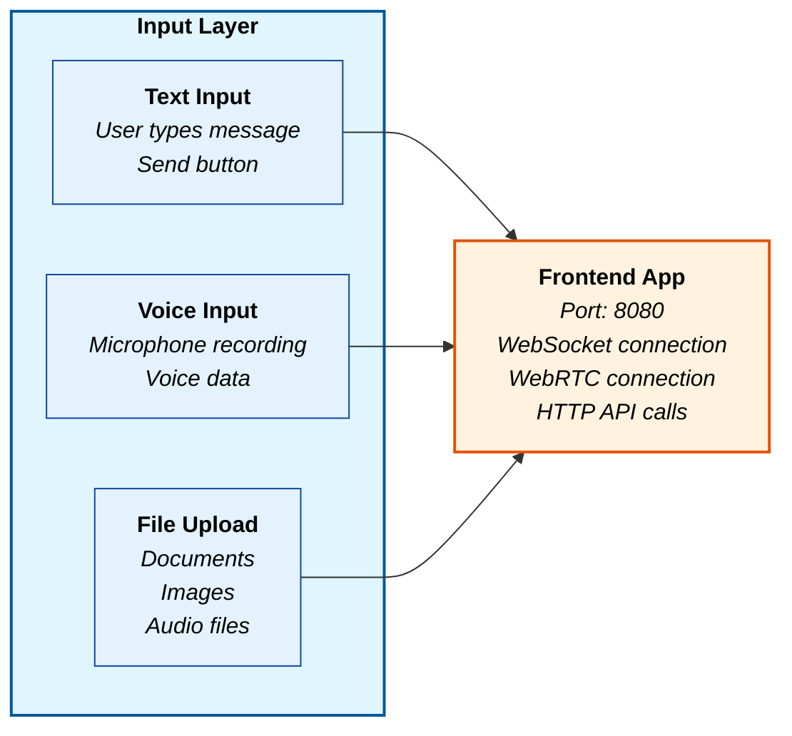
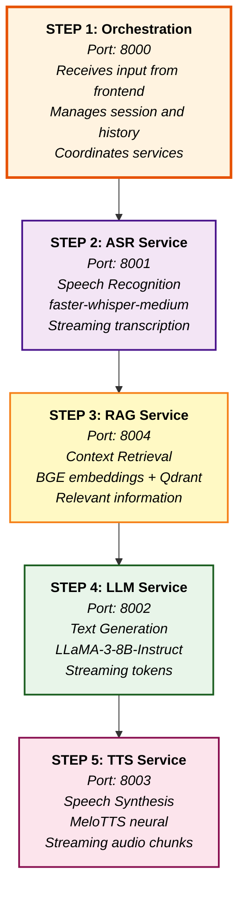
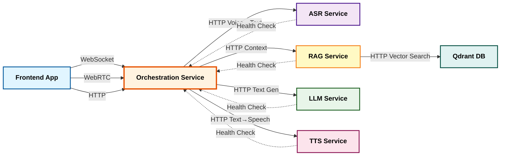

# Zevo AI - Simple Data Flow Block Diagram

## Complete Data Flow from Input to Output

## Input Processing

## Core Processing Pipeline

## Complete Data Flow Diagram

```mermaid
graph TB
    UserInput["<b>USER INPUT</b><br/><i>Text: Hi there!</i><br/><i>Voice: Audio</i>"]

    Frontend1["<b>Frontend App</b><br/><i>Port: 8080</i><br/><i>WebSocket connection</i><br/><i>WebRTC data channel</i><br/><i>HTTP API calls</i>"]

    Orchestration["<b>Orchestration Service</b><br/><i>Port: 8000</i><br/><i>Session management</i><br/><i>Conversation history</i><br/><i>Pipeline coordination</i>"]

    ASR["<b>ASR Service</b><br/><i>Port: 8001</i><br/><i>faster-whisper-medium</i><br/><i>Voice → Text</i><br/><i>Streaming transcription</i>"]

    RAG["<b>RAG Service</b><br/><i>Port: 8004</i><br/><i>BGE-Large-EN-v1.5</i><br/><i>Qdrant vector search</i><br/><i>Context retrieval</i>"]

    LLM["<b>LLM Service</b><br/><i>Port: 8002</i><br/><i>LLaMA-3-8B-Instruct</i><br/><i>AWQ quantized</i><br/><i>vLLM inference</i>"]

    TTS["<b>TTS Service</b><br/><i>Port: 8003</i><br/><i>MeloTTS neural</i><br/><i>Text → Speech</i><br/><i>High-quality streaming</i>"]

    Frontend2["<b>Frontend App</b><br/><i>Port: 8080</i><br/><i>HTML5 audio playback</i><br/><i>Real-time streaming</i><br/><i>UI updates</i>"]

    AudioOutput["<b>Audio Output</b><br/><i>Hi there! It's nice</i><br/><i>to chat with you</i>"]

    UserInput --> Frontend1
    Frontend1 --> Orchestration
    Orchestration --> ASR
    ASR --> RAG
    RAG --> LLM
    LLM --> TTS
    TTS --> Frontend2
    Frontend2 --> AudioOutput

    style UserInput fill:#e1f5ff,stroke:#01579b,stroke-width:2px,color:#000
    style Frontend1 fill:#fff3e0,stroke:#e65100,stroke-width:2px,color:#000
    style Frontend2 fill:#fff3e0,stroke:#e65100,stroke-width:2px,color:#000
    style Orchestration fill:#fff3e0,stroke:#e65100,stroke-width:3px,color:#000
    style ASR fill:#f3e5f5,stroke:#4a148c,stroke-width:2px,color:#000
    style RAG fill:#fff9c4,stroke:#f57f17,stroke-width:2px,color:#000
    style LLM fill:#e8f5e9,stroke:#1b5e20,stroke-width:2px,color:#000
    style TTS fill:#fce4ec,stroke:#880e4f,stroke-width:2px,color:#000
    style AudioOutput fill:#e1f5ff,stroke:#01579b,stroke-width:2px,color:#000
```

## Service Communication Flow

## Data Processing Summary

### Input Types

- **Text**: Direct text input from user
- **Voice**: Audio recording from microphone
- **Files**: Document uploads for context

### Processing Steps

1. **ASR**: Voice → Text (faster-whisper-medium)
2. **RAG**: Context retrieval (BGE + Qdrant)
3. **LLM**: Text generation (LLaMA-3-8B)
4. **TTS**: Text → Speech (MeloTTS)

### Output

- High-quality audio response
- Real-time streaming
- Context-aware conversations

### Technologies

- **WebSocket**: Real-time communication
- **WebRTC**: Ultra-low latency voice
- **HTTP**: Service-to-service communication
- **Docker**: Containerized services

This simple block diagram shows the complete data flow including ASR (Automatic Speech Recognition) service, which converts voice input to text before processing through the RAG, LLM, and TTS services. The flow is clear and easy to understand!
