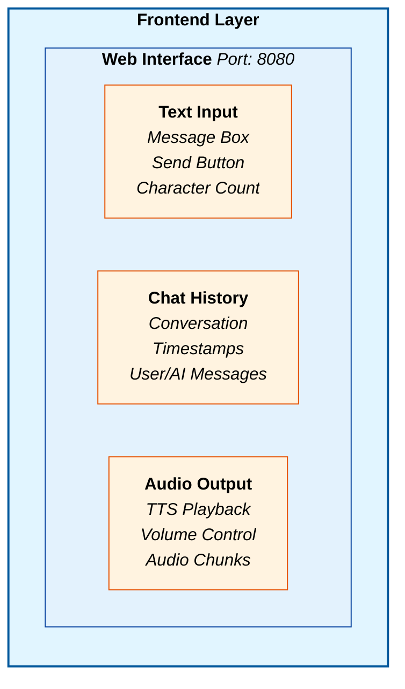
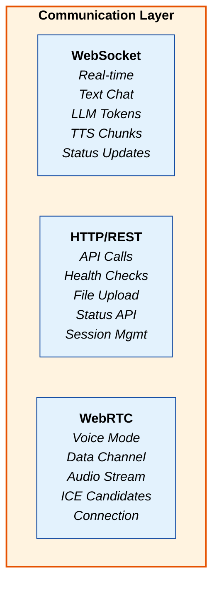
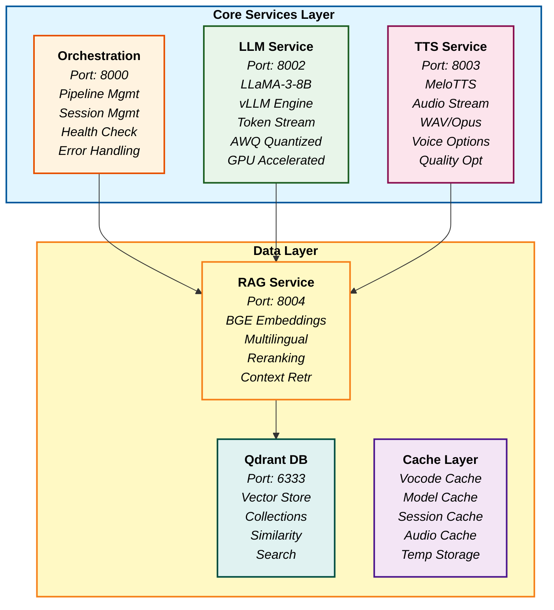

# Zevo AI - Text Mode Architecture Block Diagram

## High-Level Architecture for Text Mode

**Zevo AI Text Mode Architecture** - Production-Grade Conversational AI Platform

## Frontend Layer



## Communication Layer



## Core Services Layer



## Text Mode Processing Flow

```mermaid
graph LR
    UserInput["<b>User Input</b><br/><i>Text or Voice</i>"]
    
    Frontend1["<b>Frontend App</b><br/><i>Input Valid</i><br/><i>UI Update</i><br/><i>Send Message</i><br/><i>Voice Input?</i>"]
    
    Orchestration["<b>Orchestration Service</b><br/><i>Session Mgmt</i><br/><i>History Store</i><br/><i>Context Prep</i><br/><i>ASR (if voice)</i>"]
    
    RAG["<b>RAG Service</b><br/><i>Query Embed</i><br/><i>Vector Search</i><br/><i>Context Retr</i>"]
    
    LLM["<b>LLM Service</b><br/><i>Token Stream</i><br/><i>Real-time streaming</i><br/><i>Response Gen</i><br/><i>Context Aware</i>"]
    
    Frontend2["<b>Frontend App</b><br/><i>Text Display</i><br/><i>Streaming Markdown</i><br/><i>UI Update</i><br/><i>History Add</i><br/><i>Speaker Icon</i>"]
    
    UserOutput["<b>User Output</b><br/><i>Text + Optional Audio</i><br/><i>via Speaker Icon</i>"]
    
    UserInput --> Frontend1
    Frontend1 --> Orchestration
    Orchestration --> RAG
    RAG --> LLM
    LLM --> Frontend2
    Frontend2 --> UserOutput
    
    style UserInput fill:#e1f5ff,stroke:#01579b,stroke-width:2px,color:#000
    style Frontend1 fill:#fff3e0,stroke:#e65100,stroke-width:2px,color:#000
    style Frontend2 fill:#fff3e0,stroke:#e65100,stroke-width:2px,color:#000
    style Orchestration fill:#fff3e0,stroke:#e65100,stroke-width:3px,color:#000
    style RAG fill:#fff9c4,stroke:#f57f17,stroke-width:2px,color:#000
    style LLM fill:#e8f5e9,stroke:#1b5e20,stroke-width:2px,color:#000
    style UserOutput fill:#e1f5ff,stroke:#01579b,stroke-width:2px,color:#000
```



### Text Mode Features (Latest)

- **Real-Time Streaming**: Token-by-token LLM streaming for ChatGPT-like experience
- **Voice Input Support**: ASR transcription for text mode voice input (no automatic TTS)
- **Manual TTS**: On-demand audio playback via speaker icon (calls `/api/tts`)
- **Markdown Rendering**: Formatted responses with proper Markdown display
- **Adaptive Responses**: Dynamic response length based on user intent

## Complete Data Flow with Service Interactions

```mermaid
graph LR
    subgraph Step1["<b>STEP 1: User Input</b>"]
        direction LR
        User["<b>User Types</b><br/><i>Hi!</i>"]
        Frontend1["<b>Frontend App</b><br/><i>Port: 8080</i>"]
        WebSocket1["<b>WebSocket</b><br/><i>Connection</i><br/><i>Real-time</i>"]
        User --> Frontend1 --> WebSocket1
    end
    
    subgraph Step2["<b>STEP 2: Orchestration</b> <i>Port: 8000</i>"]
        direction LR
        Session["<b>Session Mgmt</b><br/><i>Store History</i><br/><i>Track State</i>"]
        Context["<b>Context Prep</b><br/><i>System Prompt</i><br/><i>Recent Chat</i>"]
        Pipeline["<b>Pipeline Coord</b><br/><i>Error Handling</i><br/><i>Latency Track</i>"]
        Session --> Context --> Pipeline
    end
    
    subgraph Step3["<b>STEP 3: RAG Service</b> <i>Port: 8004</i>"]
        direction LR
        Embedding["<b>BGE Embedding</b><br/><i>1024-dim</i><br/><i>English</i>"]
        VectorSearch["<b>Qdrant Vector</b><br/><i>Similarity</i><br/><i>Top-K</i>"]
        Reranker["<b>BGE Reranker</b><br/><i>Relevance</i><br/><i>Ranking</i>"]
        Embedding --> VectorSearch --> Reranker
    end
    
    subgraph Step4["<b>STEP 4: LLM Service</b> <i>Port: 8002</i>"]
        direction LR
        LLaMA["<b>LLaMA-3</b><br/><i>8B-Instruct</i><br/><i>AWQ Quantized</i><br/><i>4K Context</i>"]
        vLLM["<b>vLLM Engine</b><br/><i>GPU Accelerated</i><br/><i>Batch Processing</i>"]
        TokenStream["<b>Token Streaming</b><br/><i>Real-time</i><br/><i>Chunked Output</i>"]
        LLaMA --> vLLM --> TokenStream
    end
    
    subgraph Step5["<b>STEP 5: Frontend Display</b> <i>Port: 8080</i>"]
        direction LR
        WebSocket2["<b>WebSocket Stream</b><br/><i>Real-time</i><br/><i>Tokens</i><br/><i>Chunked</i>"]
        TextRender["<b>Text Rendering</b><br/><i>Streaming Text</i><br/><i>Debounce Updates</i>"]
        Markdown["<b>Markdown Display</b><br/><i>Formatted</i><br/><i>Speaker Icon</i><br/><i>Manual</i>"]
        WebSocket2 --> TextRender --> Markdown
    end
    
    Note["<i>NOTE: TTS is NOT automatic in text mode.</i><br/><i>Audio only via speaker icon (manual TTS).</i>"]
    
    Step1 --> Step2
    Step2 --> Step3
    Step3 --> Step4
    Step4 --> Step5
    Step5 --> Note
    
    style Step1 fill:#e1f5ff,stroke:#01579b,stroke-width:2px,color:#000
    style Step2 fill:#fff3e0,stroke:#e65100,stroke-width:2px,color:#000
    style Step3 fill:#fff9c4,stroke:#f57f17,stroke-width:2px,color:#000
    style Step4 fill:#e8f5e9,stroke:#1b5e20,stroke-width:2px,color:#000
    style Step5 fill:#fff3e0,stroke:#e65100,stroke-width:2px,color:#000
```



## Service Communication Protocols

```
┌─────────────────────────────────────────────────────────────────────────────────┐
│                        SERVICE COMMUNICATION PROTOCOLS                         │
├─────────────────────────────────────────────────────────────────────────────────┤
│                                                                                 │
│  🌐 FRONTEND ↔ ORCHESTRATION:                                                  │
│  ┌─────────────────────────────────────────────────────────────────────────────┐ │
│  │  Protocol: WebSocket (wss://agent.zevo360.in/ws/chat/{session_id})        │ │
│  │  Message Format: JSON                                                       │ │
│  │  Direction: Bidirectional                                                   │ │
│  │  Latency: < 50ms                                                            │ │
│  │                                                                             │ │
│  │  Request Messages:                                                           │ │
│  │  • { "type": "text_message", "message": "Hi!", "session_id": "session_123" }│ │
│  │  • { "type": "health_check", "timestamp": "2025-01-19T11:24:02Z" }          │ │
│  │                                                                             │ │
│  │  Response Messages:                                                          │ │
│  │  • { "type": "llm_token", "token": "Hi", "full_response": "Hi there!" }    │ │
│  │  • { "type": "tts_chunk", "audio_chunk": "base64_encoded_audio" }          │ │
│  │  • { "type": "complete", "response": "Full text", "latency_report": {...} }│ │
│  └─────────────────────────────────────────────────────────────────────────────┘ │
│                                                                                 │
│  ORCHESTRATION ↔ LLM SERVICE:                                              │
│  ┌─────────────────────────────────────────────────────────────────────────────┐ │
│  │  Protocol: HTTP POST (http://llm-service:8002/generate_stream)             │ │
│  │  Content-Type: application/json                                            │ │
│  │  Response: Streaming JSON                                                   │ │
│  │  Latency: ~2,000ms (streaming)                                             │ │
│  │                                                                             │ │
│  │  Request Body:                                                              │ │
│  │  {                                                                          │ │
│  │    "prompt": "You are Zevo AI...\n\nUser: Hi!\nAssistant:",               │ │
│  │    "max_tokens": 150,                                                       │ │
│  │    "temperature": 0.7,                                                      │ │
│  │    "stream": true                                                           │ │
│  │  }                                                                          │ │
│  │                                                                             │ │
│  │  Response Stream:                                                            │ │
│  │  • { "token": "Hi", "finished": false }                                    │ │
│  │  • { "token": " there!", "finished": false }                                │ │
│  │  • { "token": "", "finished": true }                                        │ │
│  └─────────────────────────────────────────────────────────────────────────────┘ │
│                                                                                 │
│  ORCHESTRATION ↔ TTS SERVICE:                                               │
│  ┌─────────────────────────────────────────────────────────────────────────────┐ │
│  │  Protocol: HTTP POST (http://tts-service:8003/speak_stream)                │ │
│  │  Content-Type: application/json                                            │ │
│  │  Response: Streaming Audio (audio/wav)                                      │ │
│  │  Latency: ~1,500ms (streaming)                                              │ │
│  │                                                                             │ │
│  │  Request Body:                                                              │ │
│  │  {                                                                          │ │
│  │    "text": "Hi there! It's nice to chat with you.",                        │ │
│  │    "voice_id": "default",                                                  │ │
│  │    "sample_rate": 22050,                                                    │ │
│  │    "chunk_duration_ms": 100,                                                │ │
│  │    "use_opus": false,                                                       │ │
│  │    "bitrate": 64,                                                           │ │
│  │    "emotional_tone": "neutral"                                              │ │
│  │  }                                                                          │ │
│  │                                                                             │ │
│  │  Response Stream:                                                           │ │
│  │  • Content-Type: audio/wav                                                 │ │
│  │  • Chunk Size: ~1,280 bytes (100ms audio)                                  │ │
│  │  • Format: WAV, 22,050 Hz, 16-bit, Mono                                   │ │
│  └─────────────────────────────────────────────────────────────────────────────┘ │
│                                                                                 │
│  ORCHESTRATION ↔ RAG SERVICE:                                               │
│  ┌─────────────────────────────────────────────────────────────────────────────┐ │
│  │  Protocol: HTTP POST (http://rag-service:8004/retrieve)                    │ │
│  │  Content-Type: application/json                                            │ │
│  │  Response: JSON                                                             │ │
│  │  Latency: ~200ms                                                            │ │
│  │                                                                             │ │
│  │  Request Body:                                                              │ │
│  │  {                                                                          │ │
│  │    "query": "Hi there!",                                                    │ │
│  │    "top_k": 5,                                                              │ │
│  │    "score_threshold": 0.7                                                   │ │
│  │  }                                                                          │ │
│  │                                                                             │ │
│  │  Response Body:                                                              │ │
│  │  {                                                                          │ │
│  │    "documents": [                                                           │ │
│  │      {                                                                      │ │
│  │        "content": "Relevant context text",                                  │ │
│  │        "score": 0.85,                                                       │ │
│  │        "metadata": { "source": "document.pdf" }                            │ │
│  │      }                                                                      │ │
│  │    ]                                                                        │ │
│  │  }                                                                          │ │
│  └─────────────────────────────────────────────────────────────────────────────┘ │
│                                                                                 │
│  RAG SERVICE ↔ QDRANT DB:                                                   │
│  ┌─────────────────────────────────────────────────────────────────────────────┐ │
│  │  Protocol: HTTP POST (http://qdrant-db:6333/collections/{collection}/points/search)│ │
│  │  Content-Type: application/json                                            │ │
│  │  Response: JSON                                                             │ │
│  │  Latency: ~50ms                                                             │ │
│  │                                                                             │ │
│  │  Request Body:                                                              │ │
│  │  {                                                                          │ │
│  │    "vector": [0.1, 0.2, 0.3, ...], // 1024-dimensional embedding         │ │
│  │    "limit": 5,                                                              │ │
│  │    "with_payload": true,                                                    │ │
│  │    "score_threshold": 0.7                                                   │ │
│  │  }                                                                          │ │
│  │                                                                             │ │
│  │  Response Body:                                                             │ │
│  │  {                                                                          │ │
│  │    "result": [                                                             │ │
│  │      {                                                                      │ │
│  │        "id": "point_123",                                                   │ │
│  │        "score": 0.85,                                                       │ │
│  │        "payload": { "text": "Document content" }                           │ │
│  │      }                                                                      │ │
│  │    ]                                                                        │ │
│  │  }                                                                          │ │
│  └─────────────────────────────────────────────────────────────────────────────┘ │
└─────────────────────────────────────────────────────────────────────────────────┘
```

## Service Communication Matrix

```
┌─────────────────────────────────────────────────────────────────────────────────┐
│                           SERVICE COMMUNICATION MATRIX                         │
├─────────────────────────────────────────────────────────────────────────────────┤
│                                                                                 │
│  Frontend App (Port 8080)                                                       │
│  ├── WebSocket ──────────▶ Orchestration Service (Real-time streaming)        │
│  │   Protocol: wss://agent.zevo360.in/ws/chat/{session_id}                     │
│  │   Messages: Text input, LLM tokens, TTS chunks, status updates              │
│  ├── HTTP/REST ──────▶ Orchestration Service (API calls)                                  │
│  │   Protocol: http://agent.zevo360.in/api/chat                                │
│  │   Messages: Health checks, session management                               │
│  └── WebRTC ─────────────▶ Orchestration Service (Voice mode)                   │
│       Protocol: Data channel for ultra-low latency voice                      │
│                                                                                 │
│  Orchestration Service (Port 8000)                                              │
│  ├── HTTP ──────────────▶ LLM Service (Text generation)                        │
│  │   Protocol: http://llm-service:8002/generate_stream                        │
│  │   Models: LLaMA-3-8B-Instruct (AWQ quantized)                             │
│  │   Engine: vLLM high-throughput inference                                   │
│  ├── HTTP ──────────────▶ TTS Service (Audio synthesis)                        │
│  │   Protocol: http://tts-service:8003/speak_stream                           │
│  │   Models: MeloTTS neural synthesis                                         │
│  │   Quality: 22,050 Hz, 64 kbps, WAV format                                  │
│  ├── HTTP ──────────────▶ RAG Service (Context retrieval)                       │
│  │   Protocol: http://rag-service:8004/retrieve                                │
│  │   Models: BGE-Large-EN-v1.5 + multilingual-E5-Large                       │
│  │   Reranker: BGE-Reranker-Large                                             │
│  └── HTTP ──────────────▶ Qdrant DB (Vector search)                            │
│       Protocol: http://qdrant-db:6333/collections/{collection}/points/search   │
│       Operations: Vector similarity search, metadata filtering                  │
│                                                                                 │
│  RAG Service (Port 8004)                                                        │
│  └── HTTP ──────────────▶ Qdrant DB (Vector operations)                        │
│       Protocol: http://qdrant-db:6333/collections                              │
│       Operations: Embedding storage, vector indexing, similarity search         │
│                                                                                 │
│  All Services                                                                   │
│  └── Health Checks ────▶ Orchestration Service (Monitoring)                   │
│       Protocol: HTTP GET /health                                                │
│       Frequency: Every 5 minutes (optimized)                                   │
└─────────────────────────────────────────────────────────────────────────────────┘
```

## 🤖 AI Models & Technologies Used

```
┌─────────────────────────────────────────────────────────────────────────────────┐
│                            AI MODELS & TECHNOLOGIES                            │
├─────────────────────────────────────────────────────────────────────────────────┤
│                                                                                 │
│  🧠 LANGUAGE MODEL (LLM Service)                                               │
│  ┌─────────────────────────────────────────────────────────────────────────────┐ │
│  │  Model: meta-llama/Meta-Llama-3-8B-Instruct                               │ │
│  │  Quantization: AWQ (4-bit) for efficiency                                 │ │
│  │  Engine: vLLM high-throughput inference                                    │ │
│  │  Context Length: 4,096 tokens                                             │ │
│  │  Parameters: 8 billion                                                     │ │
│  │  GPU Memory: ~4GB (quantized)                                             │ │
│  │  Performance: 50+ tokens/second                                            │ │
│  │  Features: Streaming, batch processing, GPU acceleration                  │ │
│  └─────────────────────────────────────────────────────────────────────────────┘ │
│                                                                                 │
│  EMBEDDING MODELS (RAG Service)                                             │
│  ┌─────────────────────────────────────────────────────────────────────────────┐ │
│  │  English Embeddings: BGE-Large-EN-v1.5                                    │ │
│  │  • Dimensions: 1,024                                                       │ │
│  │  • Language: English                                                      │ │
│  │  • Use Case: Primary text embeddings                                      │ │
│  │                                                                             │ │
│  │  Multilingual Embeddings: multilingual-E5-Large                          │ │
│  │  • Dimensions: 1,024                                                       │ │
│  │  • Languages: 100+ languages supported                                    │ │
│  │  • Use Case: Cross-lingual search                                          │ │
│  │                                                                             │ │
│  │  Reranker: BGE-Reranker-Large                                             │ │
│  │  • Purpose: Context reranking and relevance scoring                       │ │
│  │  • Input: Query + document pairs                                        │ │
│  │  • Output: Relevance scores                                                     │ │
│  └─────────────────────────────────────────────────────────────────────────────┘ │
│                                                                                 │
│  🔊 TEXT-TO-SPEECH (TTS Service)                                               │
│  ┌─────────────────────────────────────────────────────────────────────────────┐ │
│  │  Primary Model: MeloTTS                                                    │ │
│  │  • Type: Neural text-to-speech                                            │ │
│  │  • Quality: High-fidelity voice synthesis                                  │ │
│  │  • Features: Voice cloning, emotional adaptation                          │ │
│  │  • Sample Rate: 22,050 Hz (CD quality)                                   │ │
│  │  • Bitrate: 64 kbps (high quality)                                       │ │
│  │  • Format: WAV (uncompressed)                                             │ │
│  │                                                                             │ │
│  │  Fallback Model: gTTS (Google Text-to-Speech)                              │ │
│  │  • Use Case: Development and fallback                                       │ │
│  │  • Quality: Standard                                                      │ │
│  │  • Format: MP3                                                            │ │
│  └─────────────────────────────────────────────────────────────────────────────┘ │
│                                                                                 │
│  💾 VECTOR DATABASE (Qdrant)                                                   │
│  ┌─────────────────────────────────────────────────────────────────────────────┐ │
│  │  Database: Qdrant Vector Database                                          │ │
│  │  • Vector Size: 1,024 dimensions                                          │ │
│  │  • Distance Metric: Cosine Similarity                                      │ │
│  │  • Index Type: HNSW (Hierarchical Navigable Small World)                  │ │
│  │  • Storage: Persistent (Docker volume)                                     │ │
│  │  • API: HTTP REST + gRPC                                                   │ │
│  │  • Performance: 1000+ queries/second                                       │ │
│  └─────────────────────────────────────────────────────────────────────────────┘ │
└─────────────────────────────────────────────────────────────────────────────────┘
```

## 🔄 Detailed Service Communication Flows

```
┌─────────────────────────────────────────────────────────────────────────────────┐
│                        DETAILED SERVICE COMMUNICATION FLOWS                    │
├─────────────────────────────────────────────────────────────────────────────────┤
│                                                                                 │
│  📱 FRONTEND → ORCHESTRATION (WebSocket)                                       │
│  ┌─────────────────────────────────────────────────────────────────────────────┐ │
│  │  Message Types:                                                             │ │
│  │  • text_message: { message: "Hi there!", session_id: "session_123" }       │ │
│  │  • health_check: { type: "ping", timestamp: "2025-01-19T11:24:02Z" }       │ │
│  │  • mode_switch: { mode: "voice", session_id: "session_123" }              │ │
│  │                                                                             │ │
│  │  Response Types:                                                            │ │
│  │  • llm_token: { token: "Hi", full_response: "Hi there!" }                 │ │
│  │  • tts_chunk: { audio_chunk: "base64_encoded_audio" }                      │ │
│  │  • complete: { response: "Full response text", latency_report: {...} }     │ │
│  │  • error: { message: "Error description", code: "ERROR_CODE" }             │ │
│  └─────────────────────────────────────────────────────────────────────────────┘ │
│                                                                                 │
│  ORCHESTRATION → LLM SERVICE (HTTP)                                        │
│  ┌─────────────────────────────────────────────────────────────────────────────┐ │
│  │  Request: POST http://llm-service:8002/generate_stream                     │ │
│  │  Body: {                                                                   │ │
│  │    "prompt": "You are Zevo AI...\n\nUser: Hi there!\nAssistant:",        │ │
│  │    "max_tokens": 150,                                                      │ │
│  │    "temperature": 0.7,                                                     │ │
│  │    "stream": true                                                           │ │
│  │  }                                                                          │ │
│  │                                                                             │ │
│  │  Response: Streaming JSON                                                   │ │
│  │  • { "token": "Hi", "finished": false }                                   │ │
│  │  • { "token": " there!", "finished": false }                               │ │
│  │  • { "token": "", "finished": true }                                       │ │
│  └─────────────────────────────────────────────────────────────────────────────┘ │
│                                                                                 │
│  ORCHESTRATION → TTS SERVICE (HTTP)                                        │
│  ┌─────────────────────────────────────────────────────────────────────────────┐ │
│  │  Request: POST http://tts-service:8003/speak_stream                        │ │
│  │  Body: {                                                                   │ │
│  │    "text": "Hi there! It's nice to chat with you.",                        │ │
│  │    "voice_id": "default",                                                  │ │
│  │    "sample_rate": 22050,                                                   │ │
│  │    "chunk_duration_ms": 100,                                               │ │
│  │    "use_opus": false,                                                      │ │
│  │    "bitrate": 64,                                                          │ │
│  │    "emotional_tone": "neutral"                                              │ │
│  │  }                                                                          │ │
│  │                                                                             │ │
│  │  Response: Streaming Audio Chunks                                           │ │
│  │  • Content-Type: audio/wav                                                 │ │
│  │  • Chunk Size: ~1,280 bytes (100ms audio)                                  │ │
│  │  • Format: WAV, 22,050 Hz, 16-bit, Mono                                   │ │
│  └─────────────────────────────────────────────────────────────────────────────┘ │
│                                                                                 │
│  ORCHESTRATION → RAG SERVICE (HTTP)                                        │
│  ┌─────────────────────────────────────────────────────────────────────────────┐ │
│  │  Request: POST http://rag-service:8004/retrieve                            │ │
│  │  Body: {                                                                   │ │
│  │    "query": "Hi there!",                                                   │ │
│  │    "top_k": 5,                                                             │ │
│  │    "score_threshold": 0.7                                                  │ │
│  │  }                                                                          │ │
│  │                                                                             │ │
│  │  Response: {                                                               │ │
│  │    "documents": [                                                          │ │
│  │      {                                                                     │ │
│  │        "content": "Relevant context text",                                 │ │
│  │        "score": 0.85,                                                      │ │
│  │        "metadata": { "source": "document.pdf" }                            │ │
│  │      }                                                                     │ │
│  │    ]                                                                        │ │
│  │  }                                                                          │ │
│  └─────────────────────────────────────────────────────────────────────────────┘ │
│                                                                                 │
│  RAG SERVICE → QDRANT DB (HTTP)                                            │
│  ┌─────────────────────────────────────────────────────────────────────────────┐ │
│  │  Request: POST http://qdrant-db:6333/collections/{collection}/points/search│ │
│  │  Body: {                                                                   │ │
│  │    "vector": [0.1, 0.2, 0.3, ...], // 1024-dimensional embedding         │ │
│  │    "limit": 5,                                                             │ │
│  │    "with_payload": true,                                                   │ │
│  │    "score_threshold": 0.7                                                  │ │
│  │  }                                                                          │ │
│  │                                                                             │ │
│  │  Response: {                                                               │ │
│  │    "result": [                                                             │ │
│  │      {                                                                     │ │
│  │        "id": "point_123",                                                  │ │
│  │        "score": 0.85,                                                      │ │
│  │        "payload": { "text": "Document content" }                          │ │
│  │      }                                                                     │ │
│  │    ]                                                                        │ │
│  │  }                                                                          │ │
│  └─────────────────────────────────────────────────────────────────────────────┘ │
└─────────────────────────────────────────────────────────────────────────────────┘
```

## Key Features & Capabilities

```
┌─────────────────────────────────────────────────────────────────────────────────┐
│                            KEY FEATURES & CAPABILITIES                         │
├─────────────────────────────────────────────────────────────────────────────────┤
│                                                                                 │
│  REAL-TIME PROCESSING                                                        │
│  • Streaming LLM tokens (real-time text generation)                            │
│  • Streaming TTS chunks (real-time audio playback)                            │
│  • WebSocket communication (low latency)                                       │
│                                                                                 │
│  HIGH-QUALITY AUDIO                                                         │
│  • 22,050 Hz sample rate (CD quality)                                         │
│  • 64 kbps bitrate (high quality)                                             │
│  • WAV format (uncompressed, clear audio)                                     │
│  • 100ms chunks (smooth playback)                                             │
│                                                                                 │
│  INTELLIGENT CONTEXT                                                        │
│  • Conversation history management                                             │
│  • RAG-powered context retrieval                                               │
│  • Multilingual support (BGE + multilingual-E5)                               │
│  • Context-aware responses                                                     │
│                                                                                 │
│  PRODUCTION-READY                                                           │
│  • Docker containerization                                                     │
│  • Health monitoring (5-minute intervals)                                      │
│  • Error handling & fallbacks                                                  │
│  • Session management                                                          │
│  • Performance tracking                                                        │
└─────────────────────────────────────────────────────────────────────────────────┘
```

## Performance Metrics

```
┌─────────────────────────────────────────────────────────────────────────────────┐
│                              PERFORMANCE METRICS                               │
├─────────────────────────────────────────────────────────────────────────────────┤
│                                                                                 │
│  RESPONSE TIMES:                                                             │
│  • Connection initialization: ~360ms                                            │
│  • Total response time: ~4.6 seconds                                           │
│  • LLM token streaming: Real-time                                            │
│  • TTS chunk streaming: Real-time                                             │
│                                                                                 │
│  THROUGHPUT:                                                                 │
│  • LLM: vLLM high-throughput inference                                        │
│  • TTS: MeloTTS optimized synthesis                                           │
│  • RAG: BGE embeddings + Qdrant vector search                                  │
│  • Audio: 100+ chunks per response                                            │
│                                                                                 │
│  RESOURCE OPTIMIZATION:                                                     │
│  • GPU acceleration (LLM + TTS)                                                │
│  • AWQ quantization (LLM efficiency)                                          │
│  • Model caching (faster startup)                                             │
│  • Health check optimization (5-minute intervals)                             │
└─────────────────────────────────────────────────────────────────────────────────┘
```

This architecture diagram shows the complete Text Mode system with all services, communication flows, data paths, and key capabilities. The system is designed for production-grade conversational AI with real-time streaming, high-quality audio, and intelligent context management.
