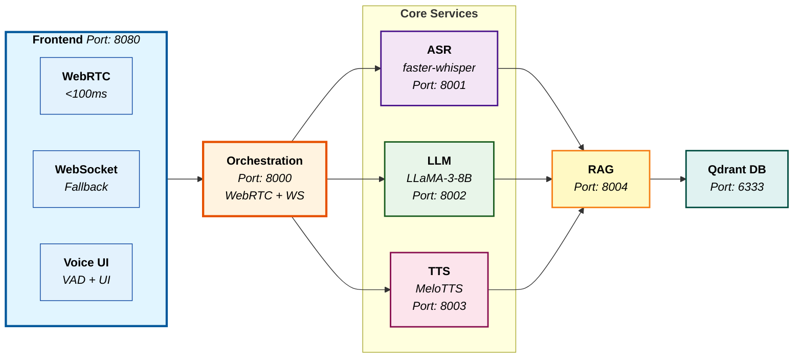

# Conversation Agent

A cutting-edge conversational AI agent with **ultra-low latency streaming**, **real-time voice interaction**, and **emotionally intelligent responses**. Built with industry-standard technologies for production deployment.

## Documentation

This project includes comprehensive documentation organized in the [`Docs/`](Docs/) folder:

### Architecture & Design

- [Text Mode Architecture](Docs/Architecture/TEXT_MODE_ARCHITECTURE.md) - Detailed text mode system architecture
- [End-to-End Architecture Flow](Docs/Architecture/ARCHITECTURE_FLOW.md) - Complete system architecture overview
- [End-to-End Workflow](Docs/Architecture/END_TO_END_WORKFLOW.md) - Complete processing workflow diagrams
- [Simple Data Flow Diagram](Docs/Architecture/SIMPLE_DATA_FLOW_DIAGRAM.md) - High-level data flow visualization

### Deployment & Operations

- [Deployment Guide](Docs/Deployment/DEPLOYMENT_GUIDE.md) - Step-by-step server deployment instructions
- [Services Structure](Docs/Services/SERVICES_STRUCTURE.md) - Service architecture and endpoints

### Development & Testing

- [Testing Guide](Docs/Testing/testing.md) - Production testing guide with API endpoints
- [Project Proposal](Docs/Development/PROJECT_PROPOSAL.md) - Original project proposal and objectives
- [RAG Ingestion App](rag_ingestion_app/README.md) - RAG ingestion application documentation

## Key Features

### **Dual-Mode Interface**

- **Text Mode**:
  - Real-time streaming text responses (ChatGPT-like experience)
  - Voice input support (speech-to-text for text messages)
  - Manual TTS playback via speaker icon (on-demand audio)
  - Markdown rendering for formatted responses
  - Adaptive response length (detailed vs concise)
- **Voice Mode**:
  - Real-time voice conversations with automatic TTS
  - Ultra-low latency (<100ms) with WebRTC
  - Voice activity detection and interruption handling
  - Continuous conversation flow

### **Advanced Streaming**

- **Real-Time LLM Streaming**: Token-by-token streaming using AsyncLLMEngine (vLLM 0.11.0)
- **Streaming TTS**: Audio chunks streamed in real-time for voice mode
- **WebSocket Communication**: Low-latency bidirectional communication
- **Anti-Buffering**: Optimized headers and heartbeat flush for continuous streaming

### **Smart Text-to-Speech**

- **Automatic TTS**: Enabled only for voice mode realtime conversations
- **Manual TTS**: On-demand playback via speaker icon in text mode
- **Smooth Playback**: Audio buffering and scheduled playback for patchy-free audio
- **Adaptive Quality**: High-quality audio synthesis with MeloTTS

### **Production-Grade Architecture**

- **Modular Services**: ASR → RAG → LLM → TTS pipeline
- **High Performance**: Optimized for speed and efficiency
- **Scalable Design**: Containerized microservices
- **Comprehensive Monitoring**: Latency tracking and performance analytics

## Architecture



## Technology Stack

### **Core Services**

- **ASR**: faster-whisper-medium (streaming)
- **LLM**: LLaMA-3-8B-Instruct (AWQ-quantized) served by vLLM
- **RAG**: Qdrant with dual embeddings (BGE + multilingual-E5) + reranker
- **TTS**: MeloTTS streaming microservice with Opus codec
- **Orchestration**: FastAPI with WebRTC and WebSocket support

### **Frontend Technologies**

- **WebRTC**: Ultra-low latency data channels
- **Web Audio API**: Advanced audio processing and scheduling
- **Voice Activity Detection**: Real-time speech detection
- **Adaptive UI**: Responsive chat interface with voice indicators

### **Audio Optimization**

- **Opus Codec**: 16 kbps bitrate for speech
- **16kHz Sample Rate**: Optimized for voice recognition
- **30ms Chunks**: Real-time streaming
- **Gapless Playback**: Seamless audio continuity

## Prerequisites

### **System Requirements**

- **OS**: Linux (Ubuntu 20.04+ recommended)
- **CPU**: 25+ vCPUs
- **RAM**: 64GB+ (32GB minimum)
- **GPU**: NVIDIA GPU with 24GB+ VRAM
- **Storage**: 500GB+ SSD storage
- **Network**: Stable internet connection

### **Software Requirements**

- **Docker**: 20.10+
- **Docker Compose**: 2.0+
- **NVIDIA Docker**: nvidia-docker2
- **NVIDIA Drivers**: 550+ (recommended for CUDA 12.6)

## Quick Start

### **1. Clone and Setup**

```bash
git clone <repository-url>
cd zevo-ai
```

### **2. Build Optimized Services**

```bash
# Make build script executable
chmod +x build_optimized.sh

# Build all services with optimizations
./build_optimized.sh
```

### **3. Start Services**

```bash
# Start orchestration service first
docker compose up -d orchestration-service

# Wait for it to be ready
sleep 15

# Start frontend
docker compose up -d frontend-app

# Check status
docker compose ps
```

### **4. Access the Voice Assistant**

- **Frontend**: http://localhost:8080
- **API Docs**: http://localhost:8000/docs
- **Health Check**: http://localhost:8000/health

## Performance Optimizations

### **Phase 1: Audio Format Optimization**

- **Opus Codec**: 90% bandwidth reduction
- **16kHz Sample Rate**: Speech-optimized
- **30ms Chunks**: Real-time streaming
- **Voice Activity Detection**: WebRTC VAD

### **Phase 2: Advanced Streaming**

- **WebRTC**: Ultra-low latency (<100ms)
- **Adaptive Buffering**: Network-optimized
- **WebSocket Fallback**: Compatibility
- **Echo Cancellation**: Built-in WebRTC

### **Phase 3: Voice Assistant Features**

- **Real-time VAD**: Speech detection
- **Interruption Handling**: Natural flow
- **Emotional Adaptation**: 5 tone states
- **Context Awareness**: Smart responses

## Performance Monitoring

### **Latency Tracking**

```bash
# Get latency report for a session
curl http://localhost:8000/api/latency/{session_id}

# Get performance statistics
curl http://localhost:8000/api/performance
```

### **Health Monitoring**

```bash
# Check all services
curl http://localhost:8000/health

# Individual service health
curl http://localhost:8001/health  # ASR
curl http://localhost:8002/health  # LLM
curl http://localhost:8003/health  # TTS
curl http://localhost:8004/health  # RAG
```

## Configuration

### **Environment Variables**

```bash
# LLM Service
MAX_MODEL_LEN=4096
GPU_MEMORY_UTILIZATION=0.95

# TTS Service
SAMPLE_RATE=16000
CHUNK_DURATION_MS=30
USE_OPUS=true
BITRATE=16

# Orchestration Service
WEBRTC_ENABLED=true
VAD_ENABLED=true
```

### **Audio Quality Settings**

- **High Quality**: 16 kbps Opus, 16kHz, 30ms chunks
- **Medium Quality**: 8 kbps Opus, 16kHz, 40ms chunks
- **Low Latency**: 16 kbps Opus, 16kHz, 20ms chunks

## Voice Assistant Features

### **Real-time Interaction**

- **Voice Activity Detection**: Detects when user starts/stops speaking
- **Interruption Handling**: Automatically stops TTS when user speaks
- **Natural Flow**: Human-like conversation patterns

### **Emotional Intelligence**

- **Tone Detection**: Analyzes text for emotional context
- **Adaptive Responses**: Adjusts speed and pitch based on emotion
- **Context Awareness**: Considers conversation history

### **Audio Quality**

- **Gapless Streaming**: Seamless audio playback
- **Echo Cancellation**: Built-in WebRTC processing
- **Noise Suppression**: Automatic audio enhancement

## API Endpoints

### **Core Endpoints**

- `POST /api/chat` - Text chat with streaming (text mode)
- `POST /api/tts` - On-demand TTS synthesis (speaker icon)
- `POST /chat` - Voice chat with file upload
- `WebSocket /ws/chat/{session_id}` - Real-time streaming (text & voice modes)
- `GET /health` - Service health check

### **WebRTC Endpoints**

- `POST /api/webrtc/offer` - WebRTC offer handling
- `POST /api/webrtc/ice-candidate` - ICE candidate exchange

### **Monitoring Endpoints**

- `GET /api/latency/{session_id}` - Session latency report
- `GET /api/performance` - Performance statistics
- `GET /conversation/{session_id}/history` - Chat history

## Docker Services

### **Service Ports**

- **Frontend**: 8080 (Nginx + Static Files)
- **Orchestration**: 8000 (FastAPI + WebRTC)
- **ASR**: 8001 (faster-whisper)
- **LLM**: 8002 (vLLM + LLaMA-3-8B)
- **TTS**: 8003 (MeloTTS + Opus)
- **RAG**: 8004 (Qdrant + Embeddings)
- **Qdrant**: 6333 (Vector Database)

### **Service Dependencies**

```yaml
orchestration-service:
  depends_on:
    - asr-service
    - llm-service
    - tts-service
    - rag-service

frontend-app:
  depends_on:
    - orchestration-service
```

## Docker Commands

### **Service Management**

#### **Start All Services**

```bash
# Start all services
docker compose up -d

# Start with logs
docker compose up

# Start specific services
docker compose up -d orchestration-service frontend-app
```

#### **Stop Services**

```bash
# Stop all services
docker compose down

# Stop specific services
docker compose stop orchestration-service

# Stop and remove volumes
docker compose down -v
```

#### **Restart Services**

```bash
# Restart all services
docker compose restart

# Restart specific service
docker compose restart orchestration-service

# Restart with rebuild
docker compose up -d --force-recreate orchestration-service
```

### **Individual Service Commands**

#### **Orchestration Service**

```bash
# Build orchestration service
docker compose build orchestration-service

# Build with no cache
docker compose build --no-cache orchestration-service

# Start orchestration service
docker compose up -d orchestration-service

# View logs
docker compose logs -f orchestration-service

# Execute commands in container
docker compose exec orchestration-service bash

# Check health
curl http://localhost:8000/health
```

#### **LLM Service**

```bash
# Build LLM service
docker compose build llm-service

# Start LLM service
docker compose up -d llm-service

# View logs
docker compose logs -f llm-service

# Check GPU usage
docker compose exec llm-service nvidia-smi

# Test LLM endpoint
curl -X POST http://localhost:8002/generate \
  -H "Content-Type: application/json" \
  -d '{"prompt": "Hello, how are you?", "max_tokens": 50}'
```

#### **TTS Service**

```bash
# Build TTS service
docker compose build tts-service

# Start TTS service
docker compose up -d tts-service

# View logs
docker compose logs -f tts-service

# Test TTS endpoint
curl -X POST http://localhost:8003/speak \
  -H "Content-Type: application/json" \
  -d '{"text": "Hello world", "use_opus": true}' \
  --output test_audio.wav
```

#### **ASR Service**

```bash
# Build ASR service
docker compose build asr-service

# Start ASR service
docker compose up -d asr-service

# View logs
docker compose logs -f asr-service

# Test ASR endpoint
curl -X POST http://localhost:8001/transcribe \
  -F "file=@audio_file.wav"
```

#### **RAG Service**

```bash
# Build RAG service
docker compose build rag-service

# Start RAG service
docker compose up -d rag-service

# View logs
docker compose logs -f rag-service

# Test RAG endpoint
curl -X POST http://localhost:8004/retrieve \
  -H "Content-Type: application/json" \
  -d '{"query": "artificial intelligence", "top_k": 5}'
```

#### **RAG Ingestion App**

```bash
# Build RAG ingestion service
docker compose build rag-ingestion-service

# Start RAG ingestion service
docker compose up -d rag-ingestion-service

# View logs
docker compose logs -f rag-ingestion-service

# Access web UI for uploading documents
# Open http://localhost:8005 in browser

# Test upload via API
curl -X POST http://localhost:8005/upload \
  -F "file=@your_document.pdf"

# Test retrieval
curl -X POST http://localhost:8004/retrieve \
  -H "Content-Type: application/json" \
  -d '{"query": "your search query", "top_k": 3}'

# Monitor embedding progress (watch in real-time)
docker compose logs -f rag-ingestion-service | grep -E "(chunk|embedding|ingest|Processing)"

# Monitor RAG service embedding generation
docker compose logs -f rag-service | grep -E "(Processed|Ingesting|documents)"
```

#### **Frontend App**

```bash
# Build frontend
docker compose build frontend-app

# Start frontend
docker compose up -d frontend-app

# View logs
docker compose logs -f frontend-app

# Test frontend
curl http://localhost:8080/health
```

#### **Qdrant Database**

```bash
# Start Qdrant
docker compose up -d qdrant-db

# View logs
docker compose logs -f qdrant-db

# Check Qdrant health
curl http://localhost:6333/health

# Access Qdrant dashboard
# Open http://localhost:6333/dashboard in browser
```

### **Monitoring Commands**

#### **Service Status**

```bash
# Check all services status
docker compose ps

# Check specific service
docker compose ps orchestration-service

# Check resource usage
docker stats

# Check service health
docker compose exec orchestration-service curl http://localhost:8000/health
```

#### **Logs Management**

```bash
# View all logs
docker compose logs

# View logs with timestamps
docker compose logs -t

# View last 100 lines
docker compose logs --tail=100

# Follow logs for specific service
docker compose logs -f orchestration-service

# View logs since specific time
docker compose logs --since="2024-01-01T00:00:00"
```

#### **Resource Monitoring**

```bash
# Check container resource usage
docker stats --no-stream

# Check disk usage
docker system df

# Check network usage
docker network ls
docker network inspect zevo-ai_zevo-network
```

### **Development Commands**

#### **Debugging**

```bash
# Access container shell
docker compose exec orchestration-service bash
docker compose exec llm-service bash
docker compose exec tts-service bash

# Check container environment
docker compose exec orchestration-service env

# Check container processes
docker compose exec orchestration-service ps aux

# Check container network
docker compose exec orchestration-service netstat -tulpn
```

#### **Testing Commands**

```bash
# Test WebSocket connection
curl -i -N -H "Connection: Upgrade" \
-H "Upgrade: websocket" \
-H "Sec-WebSocket-Key: dGhlIHNhbXBsZSBub25jZQ==" \
-H "Sec-WebSocket-Version: 13" \
http://localhost:8000/ws/chat/test

# Test streaming endpoints
curl -N http://localhost:8002/generate_stream \
-H "Content-Type: application/json" \
-d '{"prompt": "Hello", "max_tokens": 10}'

curl -N http://localhost:8003/speak_stream \
-H "Content-Type: application/json" \
-d '{"text": "Hello world", "use_opus": true}'
```

### **Maintenance Commands**

#### **Cleanup**

```bash
# Remove stopped containers
docker container prune

# Remove unused images
docker image prune

# Remove unused volumes
docker volume prune

# Remove unused networks
docker network prune

# Clean everything
docker system prune -a
```

#### **Backup and Restore**

```bash
# Backup Qdrant data
docker compose exec qdrant-db tar -czf /tmp/qdrant-backup.tar.gz /qdrant/storage
docker cp $(docker compose ps -q qdrant-db):/tmp/qdrant-backup.tar.gz ./qdrant-backup.tar.gz

# Restore Qdrant data
docker cp ./qdrant-backup.tar.gz $(docker compose ps -q qdrant-db):/tmp/
docker compose exec qdrant-db tar -xzf /tmp/qdrant-backup.tar.gz -C /
```

#### **Updates**

```bash
# Pull latest images
docker compose pull

# Rebuild and restart all services
docker compose down
docker compose build --no-cache
docker compose up -d

# Update specific service
git pull origin master
docker compose build --no-cache <service-name>
docker compose up -d <service-name>
docker compose logs -f <service-name>

# Example: Update orchestration service
git pull origin master
docker compose build --no-cache orchestration-service
docker compose up -d orchestration-service
docker compose logs -f orchestration-service

```

## Troubleshooting

### **Common Issues**

#### **WebRTC Connection Failed**

```bash
# Check if WebRTC is enabled
docker compose logs orchestration-service | grep "WebRTC"

# Fallback to WebSocket
# WebRTC will automatically fallback to WebSocket if unavailable
```

#### **Audio Quality Issues**

```bash
# Check TTS service logs
docker compose logs tts-service

# Verify Opus codec
curl -H "Content-Type: application/json" \
-d '{"text":"test","use_opus":true}' \
http://localhost:8003/speak_stream
```

#### **High Latency**

```bash
# Check latency report
curl http://localhost:8000/api/performance

# Monitor service health
docker compose logs orchestration-service --tail=50
```

#### **RAG Ingestion Upload Permission Denied**

```bash
# Fix uploads directory permissions
chmod 777 uploads

# Or rebuild the container with fixed permissions
docker compose stop rag-ingestion-service
docker compose rm -f rag-ingestion-service
docker compose up -d --build rag-ingestion-service

# Alternative: Use the fix script
chmod +x fix_uploads_permissions.sh
./fix_uploads_permissions.sh
```

#### **Slow Embedding Progress**

Embedding generation can take time, especially for large documents:

- **Process**: Upload → Chunking → Embedding → Storage
- **Monitor progress**: `docker compose logs -f rag-service | grep "Processed"`
- **Performance**: ~10-50 documents/second depending on chunk size
- **Expected time**: 1-5 minutes for typical PDF (100-500 chunks)

**Check if still running**:

```bash
# Watch RAG service logs for progress
docker compose logs -f rag-service | grep -E "(Processed|Ingesting)"

# Check if process completed
docker compose logs rag-service | tail -20

# Verify documents were ingested
curl http://localhost:8004/documents/count
```

#### **File Management Issues**

**Problem**: Delete or Process buttons not working in RAG Ingestion UI

**Solution**:

```bash
# Rebuild the RAG ingestion app to get latest fixes
docker compose stop rag-ingestion-service
docker compose rm -f rag-ingestion-service
docker compose up -d --build rag-ingestion-service

# Check logs for errors
docker compose logs -f rag-ingestion-service

# Verify file exists
ls -la uploads/

# Check permissions
chmod 777 uploads
```

**Manual delete**:

```bash
# Delete files manually if needed
rm uploads/[file_id]_[filename]
```

### **Performance Tuning**

```bash
# Optimize for low latency
export CHUNK_DURATION_MS=20
export USE_OPUS=true
export BITRATE=16

# Optimize for quality
export CHUNK_DURATION_MS=40
export USE_OPUS=true
export BITRATE=32
```

## Performance Benchmarks

### **Latency Targets**

- **WebRTC Streaming**: <100ms end-to-end
- **WebSocket Streaming**: <200ms end-to-end
- **Voice Activity Detection**: <50ms response time
- **Audio Processing**: <30ms per chunk

### **Bandwidth Usage**

- **Opus Codec**: 16 kbps (90% reduction vs WAV)
- **WebRTC**: Minimal overhead
- **WebSocket**: Standard HTTP overhead

### **Resource Usage**

- **GPU Memory**: 24GB+ for LLaMA-3-8B
- **RAM**: 64GB+ recommended
- **CPU**: 25+ vCPUs for optimal performance

## Security Considerations

### **Network Security**

- **HTTPS/WSS**: Encrypted connections
- **CORS**: Properly configured
- **Rate Limiting**: API protection

### **Data Privacy**

- **In-Memory Storage**: No persistent data
- **Session Management**: Secure session handling
- **Audio Processing**: Local processing only

## Contributing

### **Development Setup**

```bash
# Clone repository
git clone <repository-url>
cd zevo-ai

# Start development environment
docker compose -f docker-compose.dev.yml up -d

# Run tests
docker compose exec orchestration-service python -m pytest
```

### **Code Standards**

- **Python**: PEP 8 compliance
- **JavaScript**: ESLint configuration
- **Docker**: Multi-stage builds
- **Documentation**: Comprehensive docstrings

## Debugging Streaming

### Verifying Real-Time Streaming Across Services

The system includes comprehensive logging to track streaming flow at each layer. Use `docker compose logs` to debug end-to-end streaming.

#### Log Markers

**LLM Service**:

- `[STREAM-OUT]` - Each token emitted with timestamp and preview
- `[STREAM-COMPLETE]` - Stream completion with total tokens

**Orchestrator**:

- `[ORCH-STREAM-START]` - Streaming session started
- `[ORCH-FIRST-TOKEN]` - Time to first token (TTF) measurement
- `[ORCH-RECEIVE]` - Token received from LLM service
- `[ORCH-SLOW-FORWARD]` - Warning if forwarding takes >5ms
- `[ORCH-STREAM-COMPLETE]` - Stream completed with statistics

#### Debugging Commands

**Monitor all services for a session:**

```bash
docker compose logs -f | grep "session_1761831190522_526b361a3"
```

**Check LLM service streaming:**

```bash
docker compose logs -f zevo-llm | grep "STREAM"
```

**Check orchestrator streaming:**

```bash
docker compose logs -f zevo-orchestration | grep "ORCH-"
```

**Watch for buffering issues:**

```bash
docker compose logs -f zevo-orchestration | grep "SLOW-FORWARD"
```

**Verify real-time flow (should see continuous timestamps):**

```bash
docker compose logs -f zevo-llm zevo-orchestration | grep -E "STREAM-OUT|ORCH-RECEIVE" | head -20
```

#### Expected Behavior

**Healthy streaming:**

- `[STREAM-OUT]` logs appear continuously (not in bursts)
- `[ORCH-RECEIVE]` appears shortly after `[STREAM-OUT]` (within 10-50ms)
- `[ORCH-FIRST-TOKEN]` shows TTF < 2000ms
- No `[ORCH-SLOW-FORWARD]` warnings

**Buffering detected:**

- Large gaps between `[STREAM-OUT]` timestamps
- Multiple `[STREAM-OUT]` logs followed by single `[ORCH-RECEIVE]`
- `[ORCH-SLOW-FORWARD]` warnings appear frequently
- Tokens arrive in bursts rather than continuously

## License

This project is licensed under the MIT License - see the LICENSE file for details.

## Acknowledgments

- **OpenAI**: For LLaMA-3 model
- **Hugging Face**: For model hosting
- **MeloTTS**: For high-quality TTS
- **WebRTC**: For real-time communication
- **FastAPI**: For high-performance API framework

---

**Built for production-grade voice AI**

git add .
git status
git commit -m "Chat with RAG Context"
git push origin master

git pull origin master
docker-compose build rag-ingestion-service
docker-compose up -d rag-ingestion-service
docker-compose logs -f rag-ingestion-service rag-service

git pull origin master
docker-compose build orchestration-service llm-service
docker-compose up -d orchestration-service llm-service
docker-compose logs -f orchestration-service

## Verify RAG is Working in Text Chat

### Method 1: Check Logs (Recommended)

1. **Monitor orchestration service logs while chatting:**

   ```bash
   docker-compose logs -f orchestration-service | grep -E "RAG"
   ```

2. **Look for these log messages when you send a text chat message:**

   ```
   RAG: Retrieving context for query: 'your question'
   RAG: Retrieved X relevant documents
   RAG: Document count in response: X
   RAG: Top document preview: ...
   Context: Added RAG context (XXX chars) to LLM prompt
   ```

3. **If RAG is NOT working, you'll see:**
   ```
   RAG: No relevant documents found for query
   ```
   or
   ```
   RAG: Error retrieving context
   ```

### Method 2: Test with Your Ingested Document

1. **Ask a question related to your ingested PDF:**

   - Example: "What is engineering leadership?" (if you ingested Engineering Leadership PDF)
   - The response should include information from your PDF

2. **Monitor both services:**

   ```bash
   # Terminal 1: Orchestration logs
   docker-compose logs -f orchestration-service

   # Terminal 2: RAG service logs
   docker-compose logs -f rag-service
   ```

3. **You should see:**
   - **Orchestration**: `RAG: Retrieved X relevant documents`
   - **RAG Service**: `Retrieved X documents from search`

### Method 3: Check Document Count in Qdrant

Verify documents are actually stored:

```bash
curl http://localhost:8004/documents/count
```

Should return: `{"total_documents": X}` where X > 0

### Method 4: Test RAG Directly (Debug)

Test RAG retrieval independently:

```bash
curl -X POST http://localhost:8004/retrieve \
  -H "Content-Type: application/json" \
  -d '{
    "query": "engineering leadership",
    "top_k": 5,
    "use_reranker": true,
    "language": "en"
  }'
```

If this returns documents, RAG is working. If not, check ingestion.

### Method 5: Compare Responses

**Without RAG (before fix):**

- Generic responses
- No specific information from your documents

**With RAG (after fix):**

- Responses include information from your ingested PDFs
- Logs show "RAG: Retrieved X relevant documents"
- Context is added to LLM prompt

# Working fine

docker-compose stop rag-ingestion-service
docker-compose rm -f rag-ingestion-service
